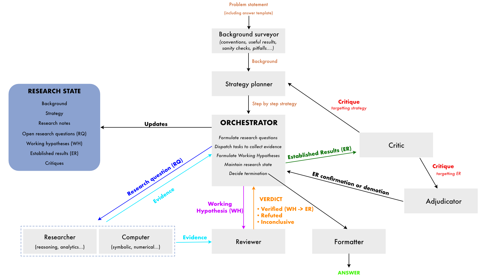

# OpenDirac

A multi-agent scaffolding system for autonomous scientific research in mathematics and theoretical physics.

## What is this?

OpenDirac takes a problem stated in plain language (e.g. "derive the Hawking temperature from the Euclidean path integral") and works through it autonomously — breaking it into sub-problems, performing derivations, writing and running verification code, and critically reviewing its own results — until it produces a coherent, verified solution.

The project ships two research modes: a **multi-agent pipeline** (the default) that orchestrates nine specialised roles, and **Autophysicist**, a lighter single-agent loop where one Research Manager dispatches ephemeral sub-agents on the fly.

**Multi-agent pipeline.** Nine specialised LLM agent roles take turns in a loop. A **surveyor** maps the research landscape before the main loop begins. A **planner** produces the initial research strategy (and can revise it when critiques demand). The **orchestrator** dispatches research questions to a **researcher** (analytical reasoning) or **computer** (code execution), and formulates working hypotheses from the evidence. Then the **reviewer** provides adversarial review (auto-triggered).  A **deep critic** periodically audits strategy and inter-result coherence, filing typed critiques that are routed back to the **planner** (for strategy revision) or to an **adjudicator** (for challenges on established results). Finally a **formatter** produces a clean `ANSWER.md` from the final research state.

No agent carries conversation history: each call starts from a fresh context. All research state lives in a structured `ResearchState` object — agents mutate it via tools, and Markdown files are rendered from it for git snapshots. The workspace is version-controlled with git, so every step is recoverable.

Supports multiple LLM providers (Anthropic, OpenAI, Google Gemini, HuggingFace) via a provider abstraction layer with a `models.yaml` registry.


## Quick Start

```bash
# Install (requires Python 3.12+ and uv)
uv sync --extra dev

# For non-Anthropic providers, install the relevant extra:
uv sync --extra openai          # OpenAI
uv sync --extra google          # Google Gemini
uv sync --extra huggingface     # HuggingFace Inference Providers
uv sync --extra all-providers   # all of the above

# To serve local models on a Linux GPU cluster (no-op on macOS):
uv sync --extra local


# Run a research problem (requires model API key in .env or env var)
uv run open_dirac problems/critpt/quantum_error_correction_main.yaml --model gemini-3-flash-preview
```

### Environment Variables

Set API keys for the providers you want to use (in `.env` or as env vars):

| Variable | Provider |
|----------|----------|
| `ANTHROPIC_API_KEY` | Anthropic |
| `OPENAI_API_KEY` | OpenAI |
| `GOOGLE_API_KEY` | Google Gemini (default) |
| `HF_TOKEN` | HuggingFace Inference Providers |

### CLI Options

```
open_dirac [problem.yaml] [options]

  problem.yaml                Problem YAML file (default: problems/critpt/quantum_error_correction_main.yaml)
  --model MODEL               LLM model key (default: from config.default.yaml, resolved via models.yaml)
  --replay DIR                Replay console log from a workspace (no run)
  --max-iterations N          Max loop iterations (default: 25)
  --max-tokens N              Max output tokens per LLM call (default: 65536)
  --workspace-dir DIR         Workspace directory (default: workspaces/YYYYMMDD_HHMMSS_<problem>)
  --resume DIR                Resume from existing workspace if DIR exists
  --config FILE               Path to config YAML file (overrides defaults)
```

### Configuration

All defaults live in `config.default.yaml` (single source of truth). Override with a config YAML file (`--config`) or individual CLI flags. The precedence is: CLI flags > config file > `config.default.yaml`.

### Verification

After a run completes, you can independently verify the scientific results using a stronger model (Claude Opus by default):

```bash
# Verify a completed workspace
uv run python -m open_dirac.verification workspaces/<run_dir>/

# Run + verify in one command
./scripts/run_and_verify.sh --max-iterations 10
```

```
python -m open_dirac.verification <workspace_dir> [options]

  --model MODEL              LLM model (default: claude-4.6-opus)
  --max-tokens N             Max output tokens (default: 65536)
```

The verifier writes `VERIFICATION.md` into the workspace. It evaluates each Established Result for mathematical/physical validity, runs a process audit, checks chain coherence between results, and outputs a verdict: VALID, PARTIALLY_VALID, INVALID, or INCONCLUSIVE. The problem definition is auto-loaded from `problem.yaml` in the workspace (copied there by `main.py` at run start).

### Autophysicist

Autophysicist is a single-agent iterative research mode. A Research Manager receives the problem, dispatches ephemeral sub-agents (with optional sandboxed code execution), and records results in two memory systems — a permanent memory (append-only, always visible) and a scratchpad (rolling window of the last N entries). Each iteration starts from a fresh context; the Manager can only "remember" what it wrote to memory. A per-iteration token budget triggers a wind-down phase that removes the sub-agent dispatch tool, forcing the Manager to consolidate and end the turn.

When the Manager is confident in a solution it calls `submit_final_answer`, which terminates the run and triggers formal evaluation (symbolic SymPy comparison + numerical fallback) against the ground truth in the problem YAML.

```bash
# Run a single problem
uv run open_dirac_autophysicist problems/tier1/hydrogen_fine_structure.yaml --model claude-4.6-opus

# With custom budget and iteration limits
uv run open_dirac_autophysicist problems/tier1/hydrogen_fine_structure.yaml \
  --max-iterations 30 --token-budget 100000 --tool-call-cap 20

# Resume an interrupted run
uv run open_dirac_autophysicist problems/tier1/hydrogen_fine_structure.yaml \
  --resume workspaces/autophysicist/<run_dir>
```

```
open_dirac_autophysicist <problem.yaml> [options]

  problem.yaml                Problem YAML file (required)
  --model MODEL               LLM model key (default: from config.default.yaml)
  --max-tokens N              Max output tokens per LLM call
  --config FILE               Path to config YAML file
  --max-iterations N          Max Manager iterations (default: 50)
  --token-budget N            Per-iteration token budget for wind-down trigger (default: 64000)
  --tool-call-cap N           Max tool calls per iteration (default: 15)
  --max-rounds N              Max LLM rounds per iteration (default: 30)
  --scratchpad-window N       Visible scratchpad entries (default: 5)
  --sandbox-timeout N         Code execution timeout in seconds (default: 60)
  --workspace-dir DIR         Workspace directory (default: auto-generated)
  --resume DIR                Resume from an existing workspace
```

#### Multiple concurrent runs (pass@k)

Run N independent instances on the same problem to collect pass@k statistics:

```bash
uv run python scripts/run_multiple_autophysicist.py problems/tier1/hydrogen_fine_structure.yaml \
  --runs 20 --concurrency 5 --model claude-4.6-opus --max-iterations 30
```

Results are written to a JSON file with per-run metrics and an aggregate summary (correct / incorrect / inconclusive / no_answer counts).

### One-shot Baseline

Run a single LLM call on a problem with no scaffolding — useful for benchmarking raw model capability against the multi-agent pipeline:

```bash
uv run python -m open_dirac.one_shot problems/critpt/quantum_error_correction_main.yaml
uv run python -m open_dirac.one_shot problems/critpt/quantum_error_correction_main.yaml --model gpt-5.4-high
uv run python -m open_dirac.one_shot problems/critpt/quantum_error_correction_main.yaml --runs 10  # multiple runs for statistics
uv run python -m open_dirac.one_shot problems/critpt/quantum_error_correction_main.yaml --config my_config.yaml
```

```
python -m open_dirac.one_shot <problem.yaml> [options]

  --model MODEL              LLM model key (default: from config.default.yaml)
  --max-tokens N             Max output tokens (default: 128000)
  --config FILE              Path to config YAML file (overrides defaults)
  --runs N                   Number of runs for batch benchmarking
  --output-dir DIR           Directory for batch result JSON files (default: results/one_shot/)
  -o FILE                    Save response with metadata to a Markdown file
```

Answers are auto-evaluated against the known answer in the problem YAML (symbolic SymPy comparison + numerical fallback).

### RSA (Recursive Self-Aggregation)

RSA maintains a population of N candidate solutions and iteratively refines them by aggregating random subsets of K candidates over T rounds (total LLM calls = N * T). The final answer is chosen by majority vote.

```bash
uv run python -m open_dirac.rsa problems/critpt/quantum_error_correction_main.yaml
uv run python -m open_dirac.rsa problems/critpt/quantum_error_correction_main.yaml -N 6 -K 2 -T 4
uv run python -m open_dirac.rsa problems/critpt/quantum_error_correction_main.yaml --model gpt-5.4-high --concurrency 4
uv run python -m open_dirac.rsa problems/critpt/quantum_error_correction_main.yaml --config my_config.yaml
```

```
python -m open_dirac.rsa <problem.yaml> [options]

  --model MODEL              LLM model key (default: from config.default.yaml)
  -N INT                     Population size (default: 6)
  -K INT                     Aggregation subset size (default: 2)
  -T INT                     Number of rounds (default: 4)
  --max-tokens N             Max output tokens per call (default: 128000)
  --config FILE              Path to config YAML file (overrides defaults)
  --concurrency N            Max parallel LLM calls within a round (default: N)
  --output-dir DIR           Directory for result JSON files (default: results/rsa/)
  -o FILE                    Save response with metadata to a Markdown file
```

### Serving Local Models with vLLM

Running a local model is a two-step process: first **serve** the model with vLLM, then **run** the problem against it.

#### End-to-end example (Nemotron Super 120B)

```bash
# Step 1 — Serve the model (submits a Slurm job; returns immediately)
./serve/serve.slurm \
  --model nvidia/NVIDIA-Nemotron-3-Super-120B-A12B-BF16 \
  --nodes 1 \
  --gpus-per-node 8

# Note the Slurm job ID printed to stdout, e.g. 12345.
# Connection details are written to serve/logs/vllm/<job_id>/endpoint.env
# as soon as the job starts (before the model finishes loading).

# Step 2 — Run a problem against the served model
# eval.slurm reads endpoint.env, waits for vLLM to be healthy (up to 30 min),
# then launches the evaluation.
./serve/eval.slurm \
  --model nvidia/NVIDIA-Nemotron-3-Super-120B-A12B-BF16 \
  --problem problems/critpt/quantum_error_correction_main.yaml \
  --serve-job 12345
```

#### Prerequisites

- `uv sync --extra local`
- `uv run hf auth whoami`
- vendored Nemotron parser plugins live in `serve/reasoning_parsers/`

#### Step 1: Serve the model

Use `serve/serve.slurm`. The script self-submits with `sbatch`, launches one `vllm serve` rank per allocated node, stores Slurm logs under `serve/logs/`, and writes connection details to `serve/logs/vllm/<job_id>/endpoint.env`.

```bash
# Qwen on 1 node, 1 GPU
./serve/serve.slurm \
  --model Qwen/Qwen3.5-4B \
  --nodes 1 \
  --gpus-per-node 1 \
  --reasoning-parser qwen3

# Nemotron Nano on 1 node, 1 GPU
./serve/serve.slurm \
  --model nvidia/NVIDIA-Nemotron-3-Nano-30B-A3B-BF16 \
  --nodes 1 \
  --gpus-per-node 1

# Nemotron Super on 2 nodes, 8 GPUs per node
./serve/serve.slurm \
  --model nvidia/NVIDIA-Nemotron-3-Super-120B-A12B-BF16 \
  --nodes 1 \
  --gpus-per-node 8

# Nemotron Cascade on 1 node, 1 GPU
./serve/serve.slurm \
  --model nvidia/Nemotron-Cascade-2-30B-A3B \
  --nodes 1 \
  --gpus-per-node 1
```

The `--reasoning-parser` flag is exposed directly. Use it to enable built-in parsers such as `qwen3`. For `nano_v3` and `super_v3`, the script automatically attaches the matching plugin file from `serve/reasoning_parsers`.

Local model keys match Hub repo IDs:

- `Qwen/Qwen3.5-4B`
- `nvidia/NVIDIA-Nemotron-3-Nano-30B-A3B-BF16`
- `nvidia/NVIDIA-Nemotron-3-Super-120B-A12B-BF16`
- `nvidia/Nemotron-Cascade-2-30B-A3B`

#### Step 2: Run the problem

**Recommended: use `serve/eval.slurm`**, which reads the serve job's `endpoint.env` and exports `VLLM_BASE_URL` automatically so the Python client connects to the correct node:

```bash
./serve/eval.slurm \
  --model nvidia/NVIDIA-Nemotron-3-Super-120B-A12B-BF16 \
  --problem problems/critpt/quantum_error_correction_main.yaml \
  --serve-job <JOB_ID>
```

**Alternative: run manually from any node.** Source the endpoint env and run:

```bash
source serve/logs/vllm/<job_id>/endpoint.env
export VLLM_BASE_URL="${BASE_URL}"
uv run python -m open_dirac.one_shot \
  problems/critpt/quantum_error_correction_main.yaml \
  --model nvidia/NVIDIA-Nemotron-3-Super-120B-A12B-BF16
```

The Python vLLM provider defaults to `http://localhost:8000/v1` but respects the `VLLM_BASE_URL` environment variable, which overrides the default with the serve job's head node IP.

## Scripts

### General

| Script | Purpose |
|--------|---------|
| `scripts/run_and_verify.sh` | Run a research session then verify results in one command |
| `scripts/one_shot_batch.sh` | Batch-run the one-shot baseline across all problems in a folder |
| `scripts/run_multiple_autophysicist.py` | Run N concurrent autophysicist instances for pass@k evaluation |
| `scripts/test_model.py` | Smoke-test a model's reasoning and tool-call support (`--list` to show available models) |

### CritPt Benchmark

These scripts run OpenDirac against the [CritPt](https://github.com/CriticalPathAI/benchmarks) benchmark suite (70 problems in `problems/critpt/yaml/`). They produce CritPt-format submission JSONs, support resume from interrupted runs, and handle rolling parallelism.

| Script | Purpose |
|--------|---------|
| `scripts/run_critpt_open_dirac.py` | Batch-run all CritPt problems through the full multi-agent pipeline |
| `scripts/run_critpt_oneshot.py` | Batch-run all CritPt problems through the one-shot baseline |
| `scripts/run_critpt_rsa.py` | Batch-run all CritPt problems through RSA |
| `scripts/analyze_batch.py` | Analyze token usage and per-agent metrics across a batch run |
| `scripts/fill_missing_critpt.py` | Fill missing submission JSONs with template answers for a complete 70-problem set |

All batch scripts support `--resume <output-dir>` to continue an interrupted run. On resume, all parameters (model, max_tokens, problem subset, RSA N/K/T, etc.) are recovered from the saved `batch_metadata.json` — no need to re-specify them. Completed submissions are automatically skipped.

```bash
# Fresh run
uv run python scripts/run_critpt_oneshot.py --model gemini-3-flash-preview --output-dir results/run1/

# Resume an interrupted run (all params recovered from batch_metadata.json)
uv run python scripts/run_critpt_oneshot.py --resume results/run1/

# Resume with different runtime settings (concurrency, timeout are overridable)
uv run python scripts/run_critpt_rsa.py --resume results/rsa_run/ --concurrency 5
```

## Supported Models

Models are registered in `models.yaml`. Use the friendly key with `--model`:

| Key | Provider | Model |
|-----|----------|-------|
| `claude-4.6-opus` | Anthropic | claude-opus-4-6 |
| `claude-4.6-sonnet` | Anthropic | claude-sonnet-4-6 |
| `gpt-5.4-high` | OpenAI | gpt-5.4 (high effort) |
| `gpt-5.4-medium` | OpenAI | gpt-5.4 (medium effort) |
| `gpt-5.4-pro` | OpenAI | gpt-5.4-pro |
| `gemini-3.1-pro-preview` | Google | gemini-3.1-pro-preview |
| `gemini-3-flash-preview` | Google | gemini-3-flash-preview |
| `deepseek-v3.2` | HuggingFace | DeepSeek-V3.2 |
| `kimi-k2.5` | HuggingFace | Kimi-K2.5 |
| `glm-5` | HuggingFace | GLM-5 |
| `gpt-oss-120b` | HuggingFace | gpt-oss-120b |
| `minimax-m2.5` | HuggingFace | MiniMax-M2.5 |
| `qwen-3.5-397B-A17B` | HuggingFace | Qwen3.5-397B-A17B |

## Architecture



Nine agent roles collaborate in a loop. Each agent gets a fresh context per call (no conversation history). All research state lives in a structured `ResearchState` object (persisted as `RESEARCH_GRAPH.json`), with Markdown files rendered from it. The workspace is a separate git repo.

The orchestrator is the only agent that *decides* what to do — it reads ResearchState and calls tools (create RQs, formulate WHs, dispatch researcher/computer, request termination). Everything else is auto-triggered by the engine in cascading fashion.

```
                    ┌───────────┐       ┌──────────┐
                    │  Surveyor  │──────>│  Planner  │     (pre-loop, one-shot)
                    └───────────┘       └─────┬────┘
                                              ▼
┌──────────────────────────────────────────────────────────────────┐
│                         Main Loop                                 │
│                                                                   │
│  Orchestrator (agentic, 9 tools)                                  │
│  Reads ResearchState, decides next action via tool calls          │
│      │                    │                       │               │
│  dispatch task       add_hypothesis         request_termination   │
│      │               (creates WH)                 │               │
│      ▼                    │                       ▼               │
│  Researcher               │              Termination Gate         │
│  or Computer              │              → Formatter → ANSWER.md  │
│      │                    │                                       │
│      │ evidence           │                                       │
│      ▼                    ▼                                       │
│  ┌────────────────────────────────────────────────────────────┐  │
│  │ Engine auto-triggers:                                       │  │
│  │                                                             │  │
│  │  WH created or ──> Reviewer ──VERIFIED──> auto-promote     │  │
│  │  stale review       (1-shot)               WH → ER         │  │
│  │                        │                                    │  │
│  │  (+ periodic       ┌───┘                                    │  │
│  │    every N) ──>  Critic                                     │  │
│  │                    (1-shot)                                  │  │
│  │                      │                                      │  │
│  │              ┌───────┴───────┐                               │  │
│  │              ▼               ▼                               │  │
│  │        Adjudicator      Planner                              │  │
│  │        (ER challenge)   (strategy revision)                  │  │
│  └────────────────────────────────────────────────────────────┘  │
│                                                                   │
│               ┌───────────────────────────┐                       │
│               │  ResearchState             │                       │
│               │  (source of truth for all  │                       │
│               │   agents, JSON + MD)       │                       │
│               └───────────────────────────┘                       │
└──────────────────────────────────────────────────────────────────┘
```

### Agents

| Agent | Role | Mode | Context source | Mutates |
|-------|------|------|----------------|---------|
| **Surveyor** | Maps the research landscape before the main loop | One-shot | Problem statement + ResearchState | `BackgroundSurvey` on ResearchState |
| **Planner** | Research strategy planning (initial + revision) | One-shot | Problem statement + background survey (+ revision trigger) | Strategy, sanity checks on ResearchState |
| **Orchestrator** | Plans next task, mutates state via tools | Agentic (9 tools) | ResearchState via renderers | ResearchState, `CURRENT_TASK.md` |
| **Researcher** | Analytical reasoning, derivation | One-shot (structured JSON) | Task + target entity + method hints + light state | Evidence on RQ/WH |
| **Computer** | Computational work via code | Agentic (4 tools) | Task + target entity + method hints + light state | Evidence on RQ/WH |
| **Reviewer** | Adversarial review without code | One-shot (structured JSON) | Focused package: WH + evidence + light state | ReviewResult on WH |
| **Deep Critic** | Strategic audit — research direction, coherence | One-shot (structured JSON) | ResearchState via `render_critic_context()` | Critique objects (typed: er/strategy/coordination) |
| **Adjudicator** | Independent evaluation of ER challenges from critic | One-shot (structured JSON) | Claim + challenge + evidence + conventions + ERs | ER demotion or critique dismissal |
| **Formatter** | Produces clean `ANSWER.md` from final research state | One-shot | ResearchState via renderers | `ANSWER.md` |

### Research Lifecycle

The typical lifecycle of a claim: **RQ → evidence → WH → review → ER**

1. Orchestrator creates a **Research Question** (RQ) and dispatches to researcher or computer
2. Researcher/Computer produces **Evidence** (reasoning or code+output), stored on the RQ
3. Orchestrator formulates a **Working Hypothesis** (WH) from the evidence (auto-copies evidence from RQ; auto-triggers review)
4. **Reviewer** examines the WH + evidence (auto-dispatched by the engine)
5. Reviewer submits review (verdict: VERIFIED/REFUTED/INCONCLUSIVE, summary, details)
6. If VERIFIED: engine auto-promotes WH to **Established Result** (ER) when all dependencies are met (cascades to other VERIFIED WHs). If REFUTED: WH is auto-abandoned and logged as a failed approach

Entity numbers are unified — RQ-003 → WH-003 → ER-003.

### Review Stack

Results go through layered review before being promoted to "Established":

1. **Reviewer** — adversarial examination of evidence, methodology, and logical consistency
2. **Strategic critique** — Deep Critic (Strategic Auditor) reviews research direction and inter-result coherence, filing typed critiques
3. **Critique routing** — ER-targeted critiques go to the **Adjudicator** for independent evaluation; strategy/coordination critiques trigger **Planner** revision
4. **Dependency tracking** — All prerequisite results must themselves be Established

Promotion from WH to ER is automatic: the engine's `_auto_promote` fires after a VERIFIED review when all dependencies are established, including cascading promotion of other VERIFIED WHs whose dependencies become satisfied. ERs are immutable — only the adjudicator can demote them (via valid critique). REFUTED WHs are auto-abandoned. Periodic critic passes run every N iterations. A post-integration validation pipeline (`validation.py`) runs 4 checks on ResearchState after every orchestrator pass — demoting unreviewed ERs, stripping phantom labels, and ensuring critique resolution consistency.

### LLM Failure Compensation

LLMs fail in predictable ways (hallucinating IDs, promoting unverified results, emitting malformed output, failing to terminate). The scaffolding compensates via ~40 mechanisms across four categories (defined in `categories.py` as `CompensationCategory`):

- **`call_reliability`** — making each LLM call succeed: transport retry, tool-call fallback, agent loop bailouts, tool execution guards
- **`state_invariants`** — keeping ResearchState consistent: post-integration validation pipeline (4 checks)
- **`loop_control`** — steering the main loop: forced critic, dispatch guards, verdict tracking, compute enrichment, termination gates
- **`output_normalization`** — cleaning agent output: per-agent response corrections, markdown parsing tolerance

All interventions are logged to `EVENT_LOG.jsonl` with category, event key, and detail.

### Workspace Files

All research state is persisted under `workspaces/<run>/` (each run gets a timestamped subdirectory, gitignored from this repo, has its own git):

| File | Purpose |
|------|---------|
| `RESEARCH_STATE.md` | Established results, working hypotheses, evidence, dead ends |
| `CURRENT_TASK.md` | Current task with YAML frontmatter + structured dispatch context |
| `RESEARCH_GRAPH.json` | Authoritative structured state (ResearchState serialized as JSON) |
| `EVIDENCE_LOG.md` | Log of all evidence and review results |
| `CRITIQUE_LOG.md` | All critiques with severity and resolution status |
| `METRICS.md` | Token usage, alerts |
| `EVENT_LOG.jsonl` | Unified event log — LLM call metadata + scaffolding intervention events |
| `ANSWER.md` | Final formatted answer (written by formatter at end of run) |
| `VERIFICATION.md` | Independent verification report (written by `--write-report`) |
| `computations/` | Saved Python scripts from computer agent |
| `derivations/` | Saved derivation files from researcher agent |

## Problem Definitions

Problems are defined in YAML files under `problems/`. Each file contains a `problem` field with the problem statement in plain language. Problems with a known `answer` field support auto-evaluation in one-shot mode.

- `problems/tier1/` — 10 core problems (Hawking temperature, QHO thermodynamics, 1D Ising, hydrogen fine structure, Casimir effect, perihelion precession, Berry phase, Chandrasekhar limit, path integral HO, φ⁴ renormalisation)
- `problems/tier2/` — 12 advanced problems (Aharonov-Bohm, bremsstrahlung, Dirac-Coulomb, H₂⁺, 2D Ising Onsager, Lamb shift, Schwinger, Stark effect, Thomas-Fermi, TOV-Buchdahl, Unruh, WKB quartic)
- `problems/critpt/` — Critical-path problems (quantum error correction decomposition)
- `problems/cfg/` — CFG/combinatorics problems

## Project Structure

```
src/open_dirac/
  main.py              — Entry point, CLI argument parsing (console_scripts: `open_dirac`)
  engine.py            — Main loop (LoopState): orchestrate → validate → enrich → dispatch → route critiques → git
  research_state.py    — ResearchState dataclass: authoritative structured state (hypotheses, evidence, critiques)
  tool_call.py         — ToolCall dataclass shared across agents and LLM layer
  config.py            — Config dataclass (model, provider, thresholds, timeouts)
  config.default.yaml  — Single source of truth for all default values
  llm.py               — Provider-agnostic LLM wrapper (call_llm, run_agent_loop) with retry + audit logging
  task.py              — Task dataclass + TaskType enum + TASK_TYPE_AGENT_MAP for typed task handling
  validation.py        — Post-integration checks (4 checks on ResearchState) + termination gates
  workspace.py         — File I/O + git operations on workspace/ + log_scaffold_event() + log_llm_call()
  metrics.py           — MetricsTracker (token counts, alerts, Markdown rendering)
  agents/
    base.py            — BaseAgent ABC with template method + retry + tool-use dispatch
    evidence_base.py   — EvidenceAgent base class shared by researcher and computer
    parsing.py         — JSON parsing utilities for structured agent output
    orchestrator/      — Plans tasks, mutates ResearchState via tools (agent.py, tools.py, prompt.md)
    computer/          — Computational work via code execution (agent.py, tools.py, prompt.md)
    researcher/        — Analytical reasoning, one-shot structured JSON (agent.py, prompt.md)
    reviewer/          — Adversarial review, one-shot structured JSON (agent.py, prompt.md)
    critic/            — Strategic audit, one-shot structured JSON (agent.py, prompt.md)
    adjudicator/       — Independent ER challenge evaluation (agent.py, prompt.md)
    formatter/         — Produces ANSWER.md from final research state (agent.py, prompt.md)
    planner/           — Research strategy: initial + revision mode (agent.py, prompt.md, prompt_revise.md)
    surveyor/          — Background surveyor: maps the research landscape (agent.py, prompt.md)
  rendering/
    snapshots.py       — Snapshot renderers: state → Markdown (RESEARCH_STATE, EVIDENCE_LOG, CRITIQUE_LOG)
    contexts.py        — Per-agent context renderers (orchestrator, critic, formatter, planner, etc.)
  verification/
    verify.py          — Independent verification script (Claude Opus, streaming)
    evaluate.py        — Answer evaluation: symbolic (SymPy) and numerical comparison
    verifier.md        — Verification prompt
    process_auditor.md — Process audit prompt
  autophysicist/
    runner.py          — Autophysicist entry point: CLI, iteration loop, formal evaluation
    tools.py           — Tool executor: dispatch_subagent, memory writes, end_turn, submit_final_answer
    subagent.py        — Ephemeral sub-agent dispatch with optional sandboxed code execution
    memory.py          — PermanentMemory (append-only) and Scratchpad (rolling window)
    prompt.md          — Research Manager system prompt
  one_shot/
    runner.py          — One-shot LLM baseline runner (no scaffolding, for benchmarking)
  rsa/
    runner.py          — RSA (Recursive Self-Aggregation) runner
  providers/
    base.py            — LLMProvider ABC + ProviderResponse dataclass
    anthropic.py       — Anthropic Claude adapter
    openai.py          — OpenAI adapter
    google.py          — Google Gemini adapter
    huggingface.py     — HuggingFace Inference Providers adapter
  utils/
    markdown.py        — YAML frontmatter parsing, section extraction, critique helpers
    sandbox.py         — Python script execution with timeout
    categories.py      — CompensationCategory enum (call_reliability, state_invariants, loop_control, output_normalization)
  models.yaml          — Model registry (friendly keys → provider + model_id + env_key + cost)
scripts/
  run_and_verify.sh    — Run a problem then verify results in one command
  one_shot_batch.sh    — Batch-run one-shot baseline across multiple problems
  test_model.py        — Smoke-test a model's reasoning and tool-call support
  run_multiple_autophysicist.py — Run N concurrent autophysicist instances for pass@k
  run_critpt_open_dirac.py — Batch-run CritPt problems through the full pipeline
  run_critpt_oneshot.py — Batch-run CritPt problems through one-shot baseline
  run_critpt_rsa.py    — Batch-run CritPt problems through RSA
  analyze_batch.py     — Analyze token usage across a CritPt batch run
  fill_missing_critpt.py — Fill missing CritPt submissions with template answers
tests/                 — pytest tests
problems/
  tier1/               — 10 core problems
  tier2/               — 12 advanced problems
  critpt/              — Critical-path problems
  cfg/                 — CFG/combinatorics problems
```

## Run tests

```bash
uv run python -m pytest -v
```
